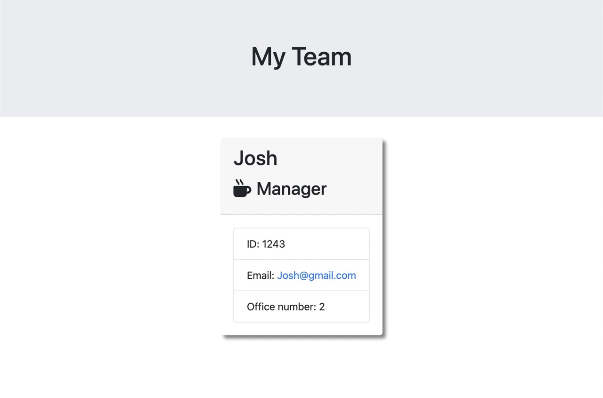

# ProfileGenerator

## Description
It is intended to generate a webpage that displays my team's basic info, so that I have quick access to their emails and GitHub profiles.

## Table of Contents
- [Title](#title)
- [Installation](#installation)
- [Usage](#usage)
- [Tests](#tests)
- [Contributing](#contributing)
- [Questions](#questions)
- [Mock-Up](#mock-up)
- [Walkthrough-Video](#walkthrough-video)

## Installation
First, create the folders/files necessary. Second, add dependencies inquirer and jest to the package.jason file.Third, install those necessary packages.

## Usage
Answer the prompts about adding employees to your team, and then the webpage is generated, displaying your team's basic info.

## License
None

## Tests
Please see below.

## Contributing
None.

## Questions
If you have any questions about the repo, open an issue or contact me directly at tiannaj23@gmail.com. You can find more of my work at [https://github.com/tiannaj23](https://github.com/https://github.com/tiannaj23/).

## Mock-Up

## Walkthrough Video
[README Generator .webm](https://drive.google.com/file/d/1Ul2yE0DsDuOxOI6HwVOW0zfw5K_2Ew6A/view)
